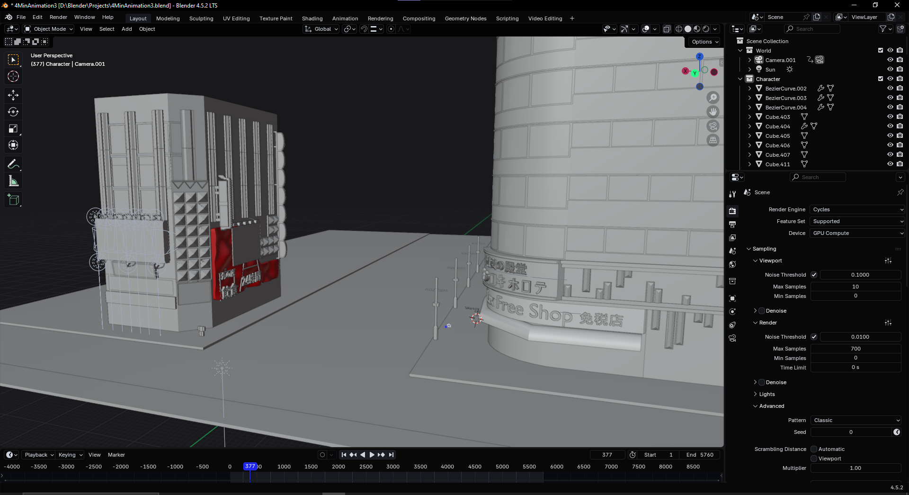
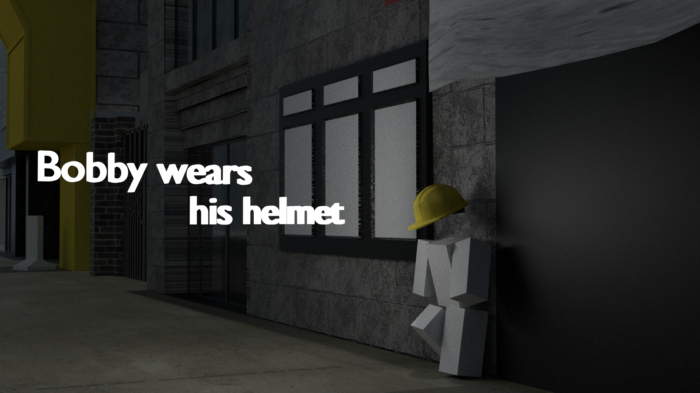

# Helmet Safety Animation

This is my college project where I created a 4-minute animation aimed at teaching children the importance of wearing a helmet for safety. The animation demonstrates safe riding practices in an engaging and educational way.

## Watch the Animation

Click the image above to watch the animation on YouTube.

## Screenshots

Here are some screenshots from the animation:

 
 
 

## Project Details

- **Objective:** Educate children on helmet safety through animation.
- **Length:** 4 minutes
- **Tools Used:** Blender (or other tools you used)
- **Audience:** Children (age 6–10)

---

### Notes

- All images are stored in the `images` folder.
- The video is uploaded as an unlisted YouTube video for easy sharing.
